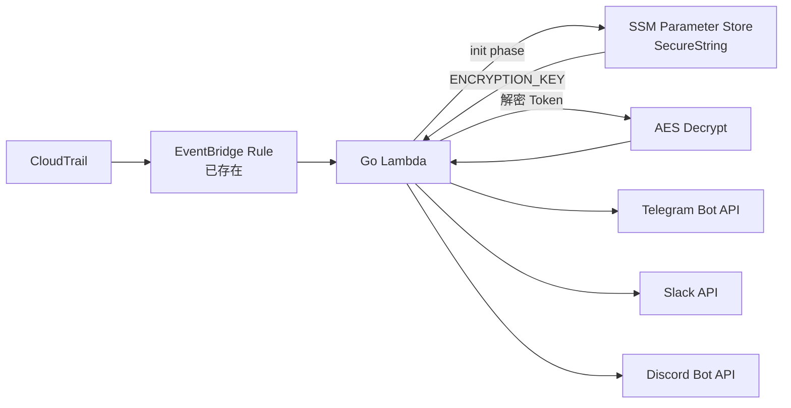
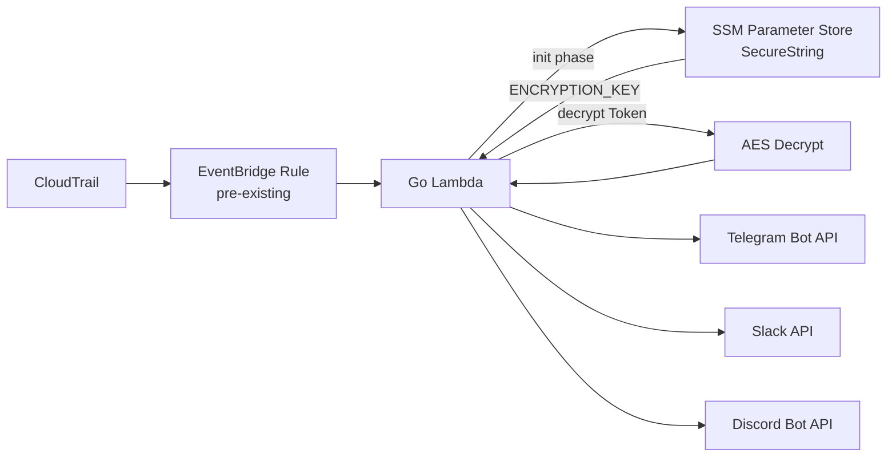

# audit-notifier

接收 AWS CloudTrail 審計事件（透過 EventBridge），發送通知到 Telegram、Slack、Discord。

## 架構



## 功能特點

- 多頻道通知（Telegram / Slack / Discord），可彈性配置
- AES-256-GCM 加密 Token，key 存放於 SSM Parameter Store
- i18n 支援（英文 / 繁體中文 / 簡體中文）
- 每個頻道獨立重試（3 次，間隔 10 秒）
- 結構化日誌（zlogger / JSON 格式）

## 快速開始

### 前置條件

- Go 1.25.6+
- AWS CLI 已配置
- Pulumi CLI 已安裝
- EventBridge Rule 已建立
- SSM Parameter Store 已建立 ENCRYPTION_KEY（SecureString 類型）

### 建置

```bash
git clone https://github.com/vincent119/audit-notifier.git
cd audit-notifier
make build
```

### 加密 Token

```bash
# 加密
make encrypt ARGS="-key=your-encryption-key -plaintext=your-bot-token"

# 解密驗證
make encrypt ARGS="-key=your-encryption-key -decrypt -ciphertext=加密後的值"
```

### 部署

建立 Pulumi 專案時，可參考以下 `Pulumi.yaml` 範例：

```yaml
name: audit-notifier
runtime: yaml
description: CloudTrail Audit Event Notification Lambda

config:
  aws:region:
    type: String
    default: ap-east-1
  roleArn:
    type: String
    description: Lambda execution role ARN
  ssmKeyPath:
    type: String
    default: /audit-notifier/encryption-key
  notifyChannels:
    type: String
    default: telegram
  tgToken:
    type: String
    default: ""
    secret: true
  slackToken:
    type: String
    default: ""
    secret: true
  discordToken:
    type: String
    default: ""
    secret: true
  tgChatIds:
    type: String
    default: ""
  slackChatIds:
    type: String
    default: ""
  discordChatIds:
    type: String
    default: ""
  msgLang:
    type: String
    default: en
  httpTimeout:
    type: String
    default: "10"
  messageMaxLength:
    type: String
    default: "2000"
  logLevel:
    type: String
    default: info
  tzZone:
    type: String
    default: UTC

resources:
  auditNotifierFunction:
    type: aws:lambda:Function
    properties:
      functionName: audit-notifier
      runtime: provided.al2023
      handler: bootstrap
      role: ${roleArn}
      code:
        fn::fileArchive: ./build/bootstrap.zip
      timeout: 60
      memorySize: 128
      environment:
        variables:
          SSM_KEY_PATH: ${ssmKeyPath}
          NOTIFY_CHANNELS: ${notifyChannels}
          TG_TOKEN: ${tgToken}
          SLACK_TOKEN: ${slackToken}
          DISCORD_TOKEN: ${discordToken}
          TG_CHAT_IDS: ${tgChatIds}
          SLACK_CHAT_IDS: ${slackChatIds}
          DISCORD_CHAT_IDS: ${discordChatIds}
          MSG_LANG: ${msgLang}
          HTTP_TIMEOUT: ${httpTimeout}
          MESSAGE_MAX_LENGTH: ${messageMaxLength}
          LOG_LEVEL: ${logLevel}
          TZ_ZONE: ${tzZone}
      tags:
        Project: audit-notifier
        ManagedBy: pulumi

outputs:
  functionArn: ${auditNotifierFunction.arn}
  functionName: ${auditNotifierFunction.functionName}
```

`Pulumi.dev.yaml` 範例：

```yaml
config:
  aws:region: ap-east-1
  audit-notifier:roleArn: "arn:aws:iam::123456789012:role/audit-notifier-lambda-role"
  audit-notifier:ssmKeyPath: /audit-notifier/encryption-key
  audit-notifier:notifyChannels: telegram
  audit-notifier:tgToken:
    secure: <加密後的值>
  audit-notifier:tgChatIds: ""
  audit-notifier:msgLang: zh-TW
  audit-notifier:logLevel: info
  audit-notifier:tzZone: Asia/Taipei
```

```bash
pulumi stack select dev
pulumi up
```

## 環境變數

| 變數名 | 說明 | 加密 | 預設值 |
|---|---|---|---|
| `SSM_KEY_PATH` | SSM Parameter Store 中 ENCRYPTION_KEY 的路徑 | 否 | 無（必填） |
| `NOTIFY_CHANNELS` | 啟用的頻道清單（逗號分隔） | 否 | 無（必填） |
| `SLACK_TOKEN` | Slack Bot Token | AES 加密 | 無 |
| `TG_TOKEN` | Telegram Bot Token | AES 加密 | 無 |
| `DISCORD_TOKEN` | Discord Bot Token | AES 加密 | 無 |
| `SLACK_CHAT_IDS` | Slack 頻道 ID（逗號分隔） | 否 | 無 |
| `TG_CHAT_IDS` | Telegram Chat ID（逗號分隔） | 否 | 無 |
| `DISCORD_CHAT_IDS` | Discord Channel ID（逗號分隔） | 否 | 無 |
| `MSG_LANG` | 訊息語言：`en`、`zh-TW`、`zh-CN` | 否 | `en` |
| `HTTP_TIMEOUT` | HTTP Client timeout（秒） | 否 | `10` |
| `MESSAGE_MAX_LENGTH` | 訊息最大字元數（所有平台共用） | 否 | `2000` |
| `LOG_LEVEL` | 日誌級別：debug, info, warn, error | 否 | `info` |
| `TZ_ZONE` | 訊息顯示的時區（IANA 格式） | 否 | `UTC` |

## 專案結構

```
audit-notifier/
├── cmd/
│   ├── lambda/          # Lambda entry point
│   │   └── main.go
│   └── encrypt/         # CLI 加密工具
│       └── main.go
├── docs/
│   └── iam-policy.md   # IAM Role / Policy 說明（不在本專案部署範圍）
├── internal/
│   ├── crypto/          # AES 加解密
│   │   ├── crypto.go
│   │   └── crypto_test.go
│   ├── event/           # CloudTrail 事件解析
│   │   ├── parser.go
│   │   └── parser_test.go
│   ├── message/         # 訊息模板格式化
│   │   ├── formatter.go
│   │   ├── i18n.go
│   │   └── formatter_test.go
│   └── notifier/        # 通知發送（TG, Slack, Discord）
│       ├── notifier.go
│       ├── telegram.go
│       ├── slack.go
│       ├── discord.go
│       └── notifier_test.go
├── Makefile
├── go.mod
└── go.sum
```

## DLQ 建議

建議為 Lambda 設定 SQS Dead Letter Queue，確保 EventBridge 重試耗盡後事件不會丟失。可在部署 Lambda 的 IaC 專案中加入 SQS Queue 並設定為 Lambda 的 DLQ。

## 已知限制

1. EventBridge at-least-once delivery 可能導致重複通知，對於 audit 場景屬可接受行為
2. 訊息超過 MESSAGE_MAX_LENGTH（預設 2000 字元）時會截斷
3. Lambda timeout 建議至少 60 秒（重試 3 x 10s = 30s）
4. SSM GetParameter 在 cold start 增加約 10-50ms 延遲

## 授權

MIT

---

# audit-notifier

Receives AWS CloudTrail audit events (via EventBridge) and sends notifications to Telegram, Slack, and Discord.

## Architecture



## Features

- Multi-channel notifications (Telegram / Slack / Discord), flexibly configurable
- AES-256-GCM encrypted tokens, key stored in SSM Parameter Store
- i18n support (English / Traditional Chinese / Simplified Chinese)
- Independent retry per channel (3 attempts, 10-second interval)
- Structured logging (zlogger / JSON format)

## Quick Start

### Prerequisites

- Go 1.25.6+
- AWS CLI configured
- Pulumi CLI installed
- EventBridge Rule created
- SSM Parameter Store with ENCRYPTION_KEY (SecureString type)

### Build

```bash
git clone https://github.com/vincent119/audit-notifier.git
cd audit-notifier
make build
```

### Encrypt Tokens

```bash
# Encrypt
make encrypt ARGS="-key=your-encryption-key -plaintext=your-bot-token"

# Decrypt to verify
make encrypt ARGS="-key=your-encryption-key -decrypt -ciphertext=encrypted-value"
```

### Deploy

Refer to the `Pulumi.yaml` and `Pulumi.dev.yaml` examples in the Traditional Chinese section above for Pulumi project configuration.

```bash
pulumi stack select dev
pulumi up
```

## Environment Variables

| Variable | Description | Encrypted | Default |
|---|---|---|---|
| `SSM_KEY_PATH` | Path to ENCRYPTION_KEY in SSM Parameter Store | No | None (required) |
| `NOTIFY_CHANNELS` | Enabled channels (comma-separated) | No | None (required) |
| `SLACK_TOKEN` | Slack Bot Token | AES encrypted | None |
| `TG_TOKEN` | Telegram Bot Token | AES encrypted | None |
| `DISCORD_TOKEN` | Discord Bot Token | AES encrypted | None |
| `SLACK_CHAT_IDS` | Slack Channel IDs (comma-separated) | No | None |
| `TG_CHAT_IDS` | Telegram Chat IDs (comma-separated) | No | None |
| `DISCORD_CHAT_IDS` | Discord Channel IDs (comma-separated) | No | None |
| `MSG_LANG` | Message language: `en`, `zh-TW`, `zh-CN` | No | `en` |
| `HTTP_TIMEOUT` | HTTP Client timeout (seconds) | No | `10` |
| `MESSAGE_MAX_LENGTH` | Max message length in characters (shared across all platforms) | No | `2000` |
| `LOG_LEVEL` | Log level: debug, info, warn, error | No | `info` |
| `TZ_ZONE` | Timezone for message display (IANA format) | No | `UTC` |

## Project Structure

```
audit-notifier/
├── cmd/
│   ├── lambda/          # Lambda entry point
│   │   └── main.go
│   └── encrypt/         # CLI encryption tool
│       └── main.go
├── docs/
│   └── iam-policy.md   # IAM Role / Policy reference (not deployed by this project)
├── internal/
│   ├── crypto/          # AES encryption/decryption
│   │   ├── crypto.go
│   │   └── crypto_test.go
│   ├── event/           # CloudTrail event parsing
│   │   ├── parser.go
│   │   └── parser_test.go
│   ├── message/         # Message template formatting
│   │   ├── formatter.go
│   │   ├── i18n.go
│   │   └── formatter_test.go
│   └── notifier/        # Notification senders (TG, Slack, Discord)
│       ├── notifier.go
│       ├── telegram.go
│       ├── slack.go
│       ├── discord.go
│       └── notifier_test.go
├── Makefile
├── go.mod
└── go.sum
```

## DLQ Recommendation

It is recommended to configure an SQS Dead Letter Queue for the Lambda function to ensure events are not lost after EventBridge retries are exhausted. The SQS Queue can be added in the IaC project that deploys the Lambda.

## Known Limitations

1. EventBridge at-least-once delivery may cause duplicate notifications, which is acceptable for audit scenarios
2. Messages exceeding MESSAGE_MAX_LENGTH (default 2000 characters) will be truncated
3. Lambda timeout should be at least 60 seconds (retry 3 x 10s = 30s)
4. SSM GetParameter adds approximately 10-50ms latency during cold start

## License

MIT
