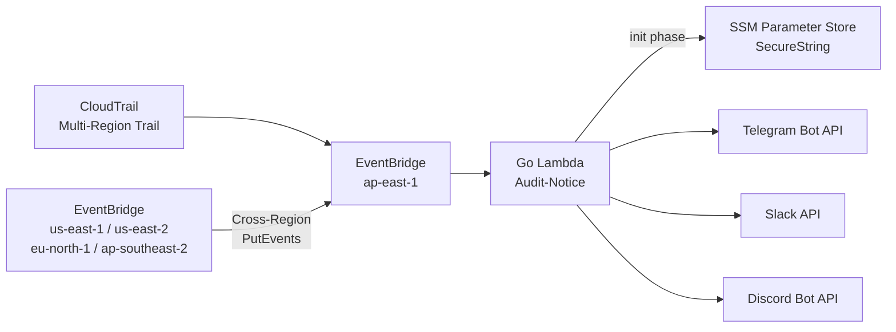

# audit-notifier

[](LICENSE)
[](https://go.dev/)
[](https://docs.aws.amazon.com/lambda/latest/dg/lambda-runtimes.html)

**語言: [English](README.md) | 繁體中文**

接收 AWS CloudTrail 審計事件（透過 EventBridge），發送即時通知到 Telegram、Slack、Discord。

## 架構



詳細架構圖、事件流程、ConsoleLogin 路由請參考：

- [系統架構](docs/zh-TW/architecture.md) - 架構總覽、事件流程圖、ConsoleLogin 路由、資源清單
- [EventBridge Rules](docs/zh-TW/eventbridge-rules.md) - Rule 涵蓋範圍、跨 Region 設定、Lambda Permissions、IaC 檔案結構
- [IAM Policy](docs/zh-TW/iam-policy.md) - Lambda IAM Role、EventBridge Cross-Region IAM Role

## 功能特點

- 多頻道通知（Telegram / Slack / Discord），可彈性配置
- AES-256-GCM 加密 Token，key 存放於 SSM Parameter Store
- i18n 支援（英文 / 繁體中文 / 簡體中文）
- 每個頻道獨立重試（3 次，間隔 10 秒）
- 結構化日誌（zlogger / JSON 格式）

## 快速開始

### 前置條件

- Go 1.25.6+
- AWS CLI 已配置
- Pulumi CLI 已安裝
- EventBridge Rules 已建立（參考 [EventBridge Rules](docs/zh-TW/eventbridge-rules.md)）
- SSM Parameter Store 已建立 ENCRYPTION_KEY（SecureString 類型）

### 建置

```bash
git clone https://github.com/vincent119/audit-notifier.git
cd audit-notifier
make build
```

### 加密 Token

```bash
# 加密
make encrypt ARGS="-key your-encryption-key -encrypt your-bot-token"

# 解密驗證
make encrypt ARGS="-key your-encryption-key -decrypt encrypted-value"
```

### 部署

建立 Pulumi 專案時，可參考以下 `Pulumi.yaml` 範例：

```yaml
name: audit-notifier
runtime: yaml
description: CloudTrail Audit Event Notification Lambda

config:
  aws:region:
    type: String
    default: ap-east-1
  roleArn:
    type: String
    description: Lambda execution role ARN
  ssmKeyPath:
    type: String
    default: /audit-notifier/encryption-key
  notifyChannels:
    type: String
    default: telegram
  tgToken:
    type: String
    default: ""
    secret: true
  slackToken:
    type: String
    default: ""
    secret: true
  discordToken:
    type: String
    default: ""
    secret: true
  tgChatIds:
    type: String
    default: ""
  slackChatIds:
    type: String
    default: ""
  discordChatIds:
    type: String
    default: ""
  msgLang:
    type: String
    default: en
  httpTimeout:
    type: String
    default: "10"
  messageMaxLength:
    type: String
    default: "2000"
  logLevel:
    type: String
    default: info
  tzZone:
    type: String
    default: UTC

resources:
  auditNotifierFunction:
    type: aws:lambda:Function
    properties:
      functionName: audit-notifier
      runtime: provided.al2023
      handler: bootstrap
      role: ${roleArn}
      code:
        fn::fileArchive: ./build/bootstrap.zip
      timeout: 60
      memorySize: 128
      environment:
        variables:
          SSM_KEY_PATH: ${ssmKeyPath}
          NOTIFY_CHANNELS: ${notifyChannels}
          TG_TOKEN: ${tgToken}
          SLACK_TOKEN: ${slackToken}
          DISCORD_TOKEN: ${discordToken}
          TG_CHAT_IDS: ${tgChatIds}
          SLACK_CHAT_IDS: ${slackChatIds}
          DISCORD_CHAT_IDS: ${discordChatIds}
          MSG_LANG: ${msgLang}
          HTTP_TIMEOUT: ${httpTimeout}
          MESSAGE_MAX_LENGTH: ${messageMaxLength}
          LOG_LEVEL: ${logLevel}
          TZ_ZONE: ${tzZone}
      tags:
        Project: audit-notifier
        ManagedBy: pulumi

outputs:
  functionArn: ${auditNotifierFunction.arn}
  functionName: ${auditNotifierFunction.functionName}
```

`Pulumi.dev.yaml` 範例：

```yaml
config:
  aws:region: ap-east-1
  audit-notifier:roleArn: "arn:aws:iam::123456789012:role/audit-notifier-lambda-role"
  audit-notifier:ssmKeyPath: /audit-notifier/encryption-key
  audit-notifier:notifyChannels: telegram
  audit-notifier:tgToken:
    secure: <加密後的值>
  audit-notifier:tgChatIds: ""
  audit-notifier:msgLang: zh-TW
  audit-notifier:logLevel: info
  audit-notifier:tzZone: Asia/Taipei
```

```bash
pulumi stack select dev
pulumi up
```

## 環境變數

| 變數名 | 說明 | 加密 | 預設值 |
|---|---|---|---|
| `SSM_KEY_PATH` | SSM Parameter Store 中 ENCRYPTION_KEY 的路徑 | 否 | 無（必填） |
| `NOTIFY_CHANNELS` | 啟用的頻道清單（逗號分隔） | 否 | 無（必填） |
| `SLACK_TOKEN` | Slack Bot Token | AES 加密 | 無 |
| `TG_TOKEN` | Telegram Bot Token | AES 加密 | 無 |
| `DISCORD_TOKEN` | Discord Bot Token | AES 加密 | 無 |
| `SLACK_CHAT_IDS` | Slack 頻道 ID（逗號分隔） | 否 | 無 |
| `TG_CHAT_IDS` | Telegram Chat ID（逗號分隔） | 否 | 無 |
| `DISCORD_CHAT_IDS` | Discord Channel ID（逗號分隔） | 否 | 無 |
| `MSG_LANG` | 訊息語言：`en`、`zh-TW`、`zh-CN` | 否 | `en` |
| `HTTP_TIMEOUT` | HTTP Client timeout（秒） | 否 | `10` |
| `MESSAGE_MAX_LENGTH` | 訊息最大字元數（所有平台共用） | 否 | `2000` |
| `LOG_LEVEL` | 日誌級別：debug, info, warn, error | 否 | `info` |
| `TZ_ZONE` | 訊息顯示的時區（IANA 格式） | 否 | `UTC` |

## 專案結構

```
audit-notifier/
├── cmd/
│   ├── lambda/              # Lambda 進入點
│   │   └── main.go
│   └── encrypt/             # CLI 加密工具
│       └── main.go
├── docs/
│   ├── en/                  # 英文文件
│   │   ├── architecture.md
│   │   ├── eventbridge-rules.md
│   │   └── iam-policy.md
│   └── zh-TW/              # 繁體中文文件
│       ├── architecture.md
│       ├── eventbridge-rules.md
│       └── iam-policy.md
├── internal/
│   ├── crypto/              # AES 加解密
│   │   ├── crypto.go
│   │   └── crypto_test.go
│   ├── event/               # CloudTrail 事件解析
│   │   ├── parser.go
│   │   └── parser_test.go
│   ├── message/             # 訊息模板格式化
│   │   ├── formatter.go
│   │   ├── i18n.go
│   │   └── formatter_test.go
│   └── notifier/            # 通知發送（TG, Slack, Discord）
│       ├── notifier.go
│       ├── telegram.go
│       ├── slack.go
│       ├── discord.go
│       └── notifier_test.go
├── Makefile
├── go.mod
└── go.sum
```

## DLQ 建議

建議為 Lambda 設定 SQS Dead Letter Queue，確保 EventBridge 重試耗盡後事件不會丟失。可在部署 Lambda 的 IaC 專案中加入 SQS Queue 並設定為 Lambda 的 DLQ。

## 已知限制

1. EventBridge at-least-once delivery 可能導致重複通知，對於 audit 場景屬可接受行為
2. 訊息超過 MESSAGE_MAX_LENGTH（預設 2000 字元）時會截斷
3. Lambda timeout 建議至少 60 秒（重試 3 x 10s = 30s）
4. SSM GetParameter 在 cold start 增加約 10-50ms 延遲

## 授權

[MIT](LICENSE)
