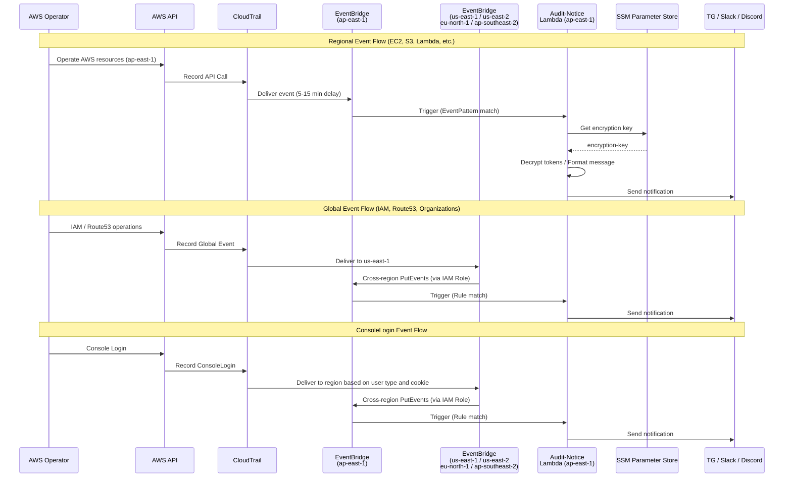
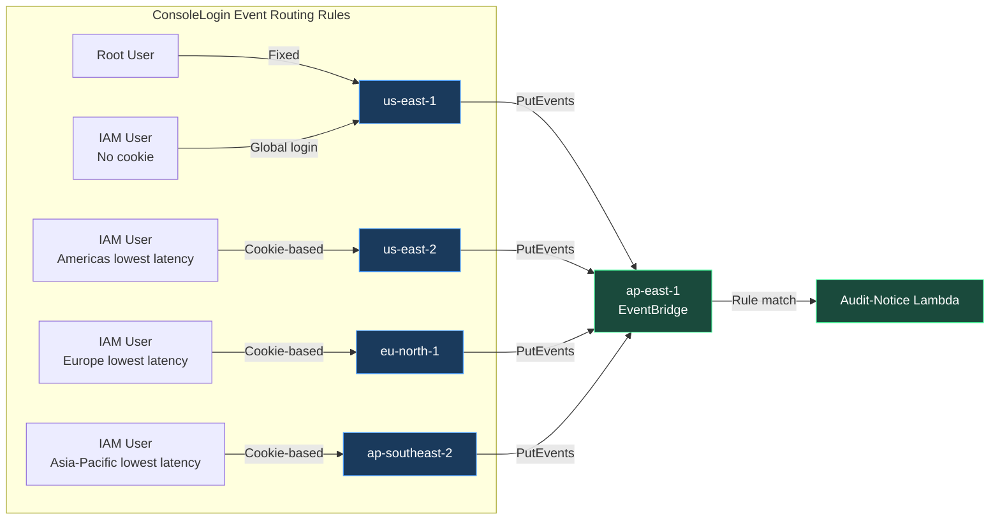

# Architecture

**Language: English | [繁體中文](../zh-TW/architecture.md)**

## Overview

```mermaid
graph TB
    subgraph AWS_ACCOUNT [AWS Account]

        subgraph SIGNIN_REGIONS [ConsoleLogin Signin Regions]
            subgraph us_east_1 [us-east-1]
                EB_USE1[EventBridge - default bus]
                RULE_USE1_LOGIN[audit-console-login<br/>ConsoleLogin]
                RULE_USE1_ID[audit-global-identity-events<br/>IAM / STS / ConsoleLogin]
                RULE_USE1_PS[audit-global-platform-security-events<br/>Route53 / Organizations]
            end

            subgraph us_east_2 [us-east-2]
                EB_USE2[EventBridge - default bus]
                RULE_USE2_LOGIN[audit-console-login<br/>ConsoleLogin]
            end

            subgraph eu_north_1 [eu-north-1]
                EB_EUN1[EventBridge - default bus]
                RULE_EUN1_LOGIN[audit-console-login<br/>ConsoleLogin]
            end

            subgraph ap_southeast_2 [ap-southeast-2]
                EB_APSE2[EventBridge - default bus]
                RULE_APSE2_LOGIN[audit-console-login<br/>ConsoleLogin]
            end
        end

        subgraph ap_east_1 [ap-east-1 Hong Kong Region]

            subgraph CLOUDTRAIL [CloudTrail]
                CT[Multi-Region Trail<br/>Regional + Global Events]
            end

            subgraph EB_REGIONAL [EventBridge - default bus]
                RULE_CN[audit-compute-network-events<br/>EC2 / ELB]
                RULE_DS[audit-datastore-events<br/>S3 / SQS / KMS / RDS / DynamoDB]
                RULE_PS[audit-platform-security-events<br/>ECR / ECS / EKS / Lambda / EventBridge<br/>WAF / CloudTrail / Config<br/>GuardDuty / CloudWatch / Organizations]
                RULE_ID[audit-identity-events<br/>IAM / STS]
                RULE_LOGIN_RECV[audit-console-login-receiver<br/>ConsoleLogin from other regions]
            end

            subgraph LAMBDA_GROUP [Lambda]
                LAMBDA[Audit-Notice<br/>Runtime: provided.al2023<br/>Handler: bootstrap<br/>Memory: 128MB / Timeout: 60s]
            end

            subgraph CW [CloudWatch]
                CW_LOG[LogGroup<br/>/aws/lambda/Audit-Notice<br/>Retention: 14 days]
            end

            subgraph SSM_GROUP [SSM Parameter Store]
                SSM["/audit-notifier/encryption-key"]
            end
        end

        subgraph IAM [IAM - Global]
            subgraph LAMBDA_IAM [Lambda IAM]
                ROLE_LAMBDA[Role: Audit-Notice-Lambda-Role<br/>Trust: lambda.amazonaws.com]
                POLICY_LAMBDA[Policy: AuditNoticeLambdaPolicy<br/>logs:CreateLogGroup/Stream/PutLogEvents<br/>ssm:GetParameter]
            end

            subgraph EB_IAM [EventBridge Cross-Region IAM]
                ROLE_EB[Role: Audit-EventBridge-CrossRegion-Role<br/>Trust: events.amazonaws.com]
                POLICY_EB[Inline: EventBridgePutEventsToApEast1<br/>events:PutEvents to ap-east-1 default bus]
            end
        end

        CT -->|Regional Events| EB_REGIONAL

        RULE_CN --> LAMBDA
        RULE_DS --> LAMBDA
        RULE_PS --> LAMBDA
        RULE_ID --> LAMBDA
        RULE_LOGIN_RECV --> LAMBDA

        RULE_USE1_LOGIN -->|PutEvents| EB_REGIONAL
        RULE_USE1_ID -->|PutEvents| EB_REGIONAL
        RULE_USE1_PS -->|PutEvents| EB_REGIONAL
        RULE_USE2_LOGIN -->|PutEvents| EB_REGIONAL
        RULE_EUN1_LOGIN -->|PutEvents| EB_REGIONAL
        RULE_APSE2_LOGIN -->|PutEvents| EB_REGIONAL

        POLICY_LAMBDA --> ROLE_LAMBDA
        ROLE_LAMBDA -.-> LAMBDA
        POLICY_EB --> ROLE_EB
        ROLE_EB -.-> RULE_USE1_LOGIN
        ROLE_EB -.-> RULE_USE1_ID
        ROLE_EB -.-> RULE_USE1_PS
        ROLE_EB -.-> RULE_USE2_LOGIN
        ROLE_EB -.-> RULE_EUN1_LOGIN
        ROLE_EB -.-> RULE_APSE2_LOGIN

        LAMBDA --> CW_LOG
        LAMBDA --> SSM
    end

    subgraph NOTIFY [Notification Channels]
        TG[Telegram Bot]
        SLACK[Slack]
        DISCORD[Discord]
    end

    LAMBDA -->|NOTIFY_CHANNELS| TG
    LAMBDA -->|NOTIFY_CHANNELS| SLACK
    LAMBDA -->|NOTIFY_CHANNELS| DISCORD

    style us_east_1 fill:#1a3a5c,stroke:#4a9eff,color:#fff
    style us_east_2 fill:#1a3a5c,stroke:#4a9eff,color:#fff
    style eu_north_1 fill:#1a3a5c,stroke:#4a9eff,color:#fff
    style ap_southeast_2 fill:#1a3a5c,stroke:#4a9eff,color:#fff
    style ap_east_1 fill:#1a4a3c,stroke:#4aff9e,color:#fff
    style IAM fill:#2a2a4a,stroke:#9a9aff,color:#fff
```

## Event Flow

## ConsoleLogin Event Routing

> **Important:** The region recorded in a ConsoleLogin event varies depending on the user type and whether you sign in using the global or a regional endpoint.
>
> - **Root user** sign-in: CloudTrail always records the event in `us-east-1`.
> - **IAM user via global endpoint**:
>   - If an account alias cookie exists in the browser, CloudTrail records the ConsoleLogin event in one of `us-east-2`, `eu-north-1`, or `ap-southeast-2`, based on latency from the user's location (the console proxy redirects accordingly).
>   - If no account alias cookie exists, CloudTrail records the event in `us-east-1` (the console proxy redirects back to global sign-in).
> - **IAM user via regional endpoint**: CloudTrail records the ConsoleLogin event in the region corresponding to that endpoint.
>
> Reference: [AWS CloudTrail Console Sign-in Events](https://docs.aws.amazon.com/awscloudtrail/latest/userguide/cloudtrail-event-reference-aws-console-sign-in-events.html)

## Resource Inventory

### Lambda (ap-east-1)

| Resource | Type | Description |
|---|---|---|
| `Audit-Notice` | Lambda Function | provided.al2023, 128MB, 60s timeout |
| `/aws/lambda/Audit-Notice` | CloudWatch LogGroup | Retention: 14 days |

### SSM Parameter Store (ap-east-1)

| Resource | Description |
|---|---|
| `/audit-notifier/encryption-key` | Token encryption/decryption key |

### Provider Mapping

| Provider | Region | Purpose |
|---|---|---|
| `aws-prod-provider` | `ap-east-1` | EventBridge Rules / Targets / Lambda / CloudWatch / SSM |
| `aws-global-provider` | `us-east-1` | IAM Roles / Policies |
| `AwsSigninUse1Provider` | `us-east-1` | EventBridge Rules (Global Events + ConsoleLogin) |
| `AwsSigninUse2Provider` | `us-east-2` | EventBridge Rule (ConsoleLogin) |
| `AwsSigninEun1Provider` | `eu-north-1` | EventBridge Rule (ConsoleLogin) |
| `AwsSigninApse2Provider` | `ap-southeast-2` | EventBridge Rule (ConsoleLogin) |
