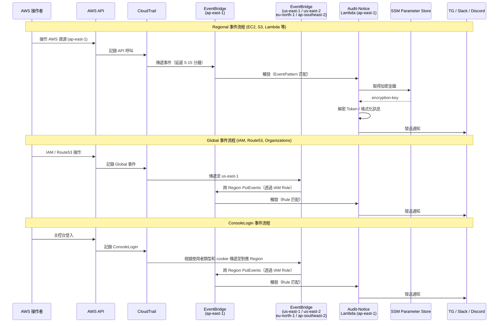
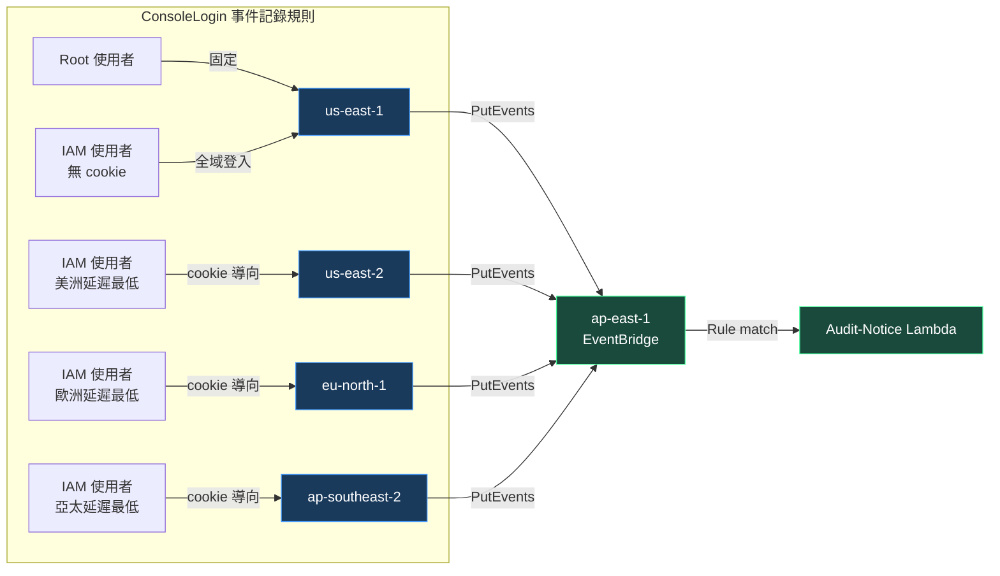

# 系統架構

**語言: [English](../en/architecture.md) | 繁體中文**

## 架構總覽

```mermaid
graph TB
    subgraph AWS_ACCOUNT [AWS Account]

        subgraph SIGNIN_REGIONS [ConsoleLogin Signin Regions]
            subgraph us_east_1 [us-east-1]
                EB_USE1[EventBridge - default bus]
                RULE_USE1_LOGIN[audit-console-login<br/>ConsoleLogin]
                RULE_USE1_ID[audit-global-identity-events<br/>IAM / STS / ConsoleLogin]
                RULE_USE1_PS[audit-global-platform-security-events<br/>Route53 / Organizations]
            end

            subgraph us_east_2 [us-east-2]
                EB_USE2[EventBridge - default bus]
                RULE_USE2_LOGIN[audit-console-login<br/>ConsoleLogin]
            end

            subgraph eu_north_1 [eu-north-1]
                EB_EUN1[EventBridge - default bus]
                RULE_EUN1_LOGIN[audit-console-login<br/>ConsoleLogin]
            end

            subgraph ap_southeast_2 [ap-southeast-2]
                EB_APSE2[EventBridge - default bus]
                RULE_APSE2_LOGIN[audit-console-login<br/>ConsoleLogin]
            end
        end

        subgraph ap_east_1 [ap-east-1 Hong Kong Region]

            subgraph CLOUDTRAIL [CloudTrail]
                CT[Multi-Region Trail<br/>Regional + Global Events]
            end

            subgraph EB_REGIONAL [EventBridge - default bus]
                RULE_CN[audit-compute-network-events<br/>EC2 / ELB]
                RULE_DS[audit-datastore-events<br/>S3 / SQS / KMS / RDS / DynamoDB]
                RULE_PS[audit-platform-security-events<br/>ECR / ECS / EKS / Lambda / EventBridge<br/>WAF / CloudTrail / Config<br/>GuardDuty / CloudWatch / Organizations]
                RULE_ID[audit-identity-events<br/>IAM / STS]
                RULE_LOGIN_RECV[audit-console-login-receiver<br/>ConsoleLogin from other regions]
            end

            subgraph LAMBDA_GROUP [Lambda]
                LAMBDA[Audit-Notice<br/>Runtime: provided.al2023<br/>Handler: bootstrap<br/>Memory: 128MB / Timeout: 60s]
            end

            subgraph CW [CloudWatch]
                CW_LOG[LogGroup<br/>/aws/lambda/Audit-Notice<br/>Retention: 14 days]
            end

            subgraph SSM_GROUP [SSM Parameter Store]
                SSM["/audit-notifier/encryption-key"]
            end
        end

        subgraph IAM [IAM - Global]
            subgraph LAMBDA_IAM [Lambda IAM]
                ROLE_LAMBDA[Role: Audit-Notice-Lambda-Role<br/>Trust: lambda.amazonaws.com]
                POLICY_LAMBDA[Policy: AuditNoticeLambdaPolicy<br/>logs:CreateLogGroup/Stream/PutLogEvents<br/>ssm:GetParameter]
            end

            subgraph EB_IAM [EventBridge Cross-Region IAM]
                ROLE_EB[Role: Audit-EventBridge-CrossRegion-Role<br/>Trust: events.amazonaws.com]
                POLICY_EB[Inline: EventBridgePutEventsToApEast1<br/>events:PutEvents to ap-east-1 default bus]
            end
        end

        CT -->|Regional Events| EB_REGIONAL

        RULE_CN --> LAMBDA
        RULE_DS --> LAMBDA
        RULE_PS --> LAMBDA
        RULE_ID --> LAMBDA
        RULE_LOGIN_RECV --> LAMBDA

        RULE_USE1_LOGIN -->|PutEvents| EB_REGIONAL
        RULE_USE1_ID -->|PutEvents| EB_REGIONAL
        RULE_USE1_PS -->|PutEvents| EB_REGIONAL
        RULE_USE2_LOGIN -->|PutEvents| EB_REGIONAL
        RULE_EUN1_LOGIN -->|PutEvents| EB_REGIONAL
        RULE_APSE2_LOGIN -->|PutEvents| EB_REGIONAL

        POLICY_LAMBDA --> ROLE_LAMBDA
        ROLE_LAMBDA -.-> LAMBDA
        POLICY_EB --> ROLE_EB
        ROLE_EB -.-> RULE_USE1_LOGIN
        ROLE_EB -.-> RULE_USE1_ID
        ROLE_EB -.-> RULE_USE1_PS
        ROLE_EB -.-> RULE_USE2_LOGIN
        ROLE_EB -.-> RULE_EUN1_LOGIN
        ROLE_EB -.-> RULE_APSE2_LOGIN

        LAMBDA --> CW_LOG
        LAMBDA --> SSM
    end

    subgraph NOTIFY [Notification Channels]
        TG[Telegram Bot]
        SLACK[Slack]
        DISCORD[Discord]
    end

    LAMBDA -->|NOTIFY_CHANNELS| TG
    LAMBDA -->|NOTIFY_CHANNELS| SLACK
    LAMBDA -->|NOTIFY_CHANNELS| DISCORD

    style us_east_1 fill:#1a3a5c,stroke:#4a9eff,color:#fff
    style us_east_2 fill:#1a3a5c,stroke:#4a9eff,color:#fff
    style eu_north_1 fill:#1a3a5c,stroke:#4a9eff,color:#fff
    style ap_southeast_2 fill:#1a3a5c,stroke:#4a9eff,color:#fff
    style ap_east_1 fill:#1a4a3c,stroke:#4aff9e,color:#fff
    style IAM fill:#2a2a4a,stroke:#9a9aff,color:#fff
```

## 事件流程

## ConsoleLogin 事件路由

> **重要：** ConsoleLogin 事件記錄的 Region 取決於使用者類型，以及登入時使用的是全域端點還是區域端點。
>
> - **Root 使用者**登入時，CloudTrail 固定將事件記錄在 `us-east-1`。
> - **IAM 使用者透過全域端點**登入時：
>   - 若瀏覽器中存在帳戶別名 cookie，CloudTrail 會根據使用者所在位置的延遲，將 ConsoleLogin 事件記錄在 `us-east-2`、`eu-north-1` 或 `ap-southeast-2` 其中之一（主控台代理會依延遲重新導向使用者）。
>   - 若瀏覽器中沒有帳戶別名 cookie，CloudTrail 將事件記錄在 `us-east-1`（主控台代理重新導向回全域登入）。
> - **IAM 使用者透過區域端點**登入時，CloudTrail 將 ConsoleLogin 事件記錄在該端點對應的 Region。
>
> 參考來源：[AWS CloudTrail 主控台登入事件](https://docs.aws.amazon.com/zh_cn/awscloudtrail/latest/userguide/cloudtrail-event-reference-aws-console-sign-in-events.html)

## 資源清單

### Lambda (ap-east-1)

| 資源 | 類型 | 說明 |
|---|---|---|
| `Audit-Notice` | Lambda Function | provided.al2023, 128MB, 60s timeout |
| `/aws/lambda/Audit-Notice` | CloudWatch LogGroup | 保留期限：14 天 |

### SSM Parameter Store (ap-east-1)

| 資源 | 說明 |
|---|---|
| `/audit-notifier/encryption-key` | Token 加解密金鑰 |

### Provider 對照

| Provider | Region | 用途 |
|---|---|---|
| `aws-prod-provider` | `ap-east-1` | EventBridge Rules / Targets / Lambda / CloudWatch / SSM |
| `aws-global-provider` | `us-east-1` | IAM Roles / Policies |
| `AwsSigninUse1Provider` | `us-east-1` | EventBridge Rules (Global Events + ConsoleLogin) |
| `AwsSigninUse2Provider` | `us-east-2` | EventBridge Rule (ConsoleLogin) |
| `AwsSigninEun1Provider` | `eu-north-1` | EventBridge Rule (ConsoleLogin) |
| `AwsSigninApse2Provider` | `ap-southeast-2` | EventBridge Rule (ConsoleLogin) |
