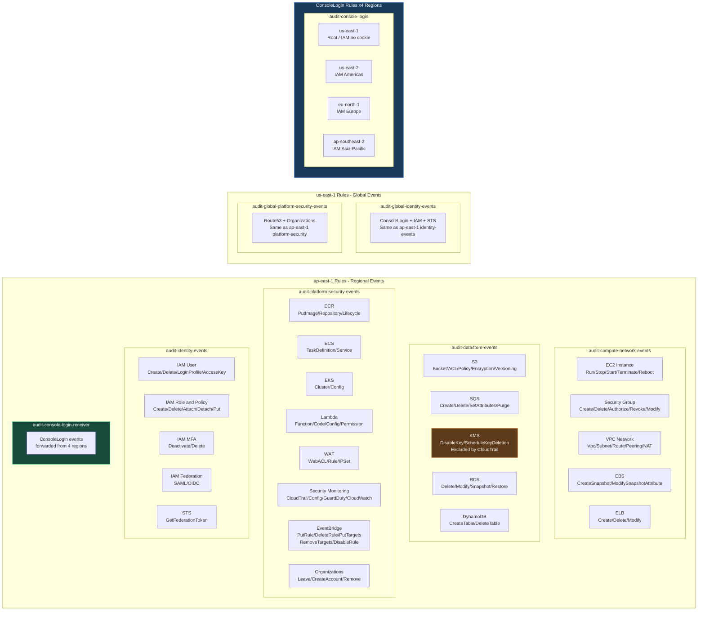

# EventBridge Rules

**語言: [English](../en/eventbridge-rules.md) | 繁體中文**

## Rule 涵蓋範圍



## ap-east-1 Regional Rules

| Rule | Source | 監控事件 |
|---|---|---|
| `audit-compute-network-events` | aws.ec2, aws.elasticloadbalancing | EC2 lifecycle, Security Group, VPC, EBS, ELB |
| `audit-datastore-events` | aws.s3, aws.sqs, aws.kms, aws.rds, aws.dynamodb | Bucket/Queue/Key/DB 操作 |
| `audit-platform-security-events` | aws.ecr/ecs/eks/lambda/route53/wafv2/waf/cloudtrail/config/guardduty/monitoring/organizations/events | 容器、Serverless、DNS、WAF、安全監控、EventBridge |
| `audit-identity-events` | aws.iam, aws.sts | IAM User/Role/Policy/MFA, STS |
| `audit-console-login-receiver` | aws.signin | ConsoleLogin（從其他 Region 轉發） |

## Cross-Region Rules

| Rule | Region | 監控事件 | Target |
|---|---|---|---|
| `audit-global-identity-events` | us-east-1 | ConsoleLogin, IAM, STS | ap-east-1 EventBridge (PutEvents) |
| `audit-global-platform-security-events` | us-east-1 | Route53, Organizations | ap-east-1 EventBridge (PutEvents) |
| `audit-console-login` | us-east-1 | ConsoleLogin | ap-east-1 EventBridge (PutEvents) |
| `audit-console-login` | us-east-2 | ConsoleLogin | ap-east-1 EventBridge (PutEvents) |
| `audit-console-login` | eu-north-1 | ConsoleLogin | ap-east-1 EventBridge (PutEvents) |
| `audit-console-login` | ap-southeast-2 | ConsoleLogin | ap-east-1 EventBridge (PutEvents) |

Cross-Region rules 使用 `Audit-EventBridge-CrossRegion-Role` IAM Role 執行 `events:PutEvents`，將事件轉發到 `ap-east-1` 的 default event bus。

## Lambda Resource-Based Policy (Permissions)

EventBridge 觸發 Lambda 需要在 Lambda 上設定 resource-based policy：

| StatementId | Source Rule | Region |
|---|---|---|
| `AllowEventBridgeComputeNetwork` | audit-compute-network-events | ap-east-1 |
| `AllowEventBridgeIdentity` | audit-identity-events | ap-east-1 |
| `AllowEventBridgeDataStore` | audit-datastore-events | ap-east-1 |
| `AllowEventBridgePlatformSecurity` | audit-platform-security-events | ap-east-1 |
| `AllowEventBridgeConsoleLoginReceiver` | audit-console-login-receiver | ap-east-1 |
| `AllowEventBridgeGlobalIdentity` | audit-global-identity-events | us-east-1 |
| `AllowEventBridgeGlobalPlatformSecurity` | audit-global-platform-security-events | us-east-1 |

## IaC 檔案結構

```
stacks/
├── global/aws/iam/
│   ├── roles/
│   │   ├── AuditNoticeLambdaRole.yaml
│   │   └── AuditEventBridgeCrossRegionRole.yaml
│   └── policies/
│       └── AuditNoticeLambdaPolicy.yaml
└── prod/aws/
    ├── EventBridge/
    │   ├── AuditTailLog/                      # ap-east-1 regional rules
    │   │   ├── AuditTailComputeNetworkRule.yaml
    │   │   ├── AuditTailDataStoreRule.yaml
    │   │   ├── AuditTailPlatformSecurityRule.yaml
    │   │   ├── AuditTailIdentityRule.yaml
    │   │   ├── AuditConsoleLoginReceiverRule.yaml
    │   │   └── AuditTailCloudTrailEventTarget.yaml
    │   ├── AuditGlobalUse1/                   # us-east-1 global + ConsoleLogin
    │   │   ├── AuditGlobalIdentityRule.yaml
    │   │   ├── AuditGlobalPlatformSecurityRule.yaml
    │   │   └── AuditGlobalEventTarget.yaml
    │   ├── AuditSigninUse2/                   # us-east-2 ConsoleLogin
    │   │   ├── AuditSigninRule.yaml
    │   │   └── AuditSigninTarget.yaml
    │   ├── AuditSigninEun1/                   # eu-north-1 ConsoleLogin
    │   │   ├── AuditSigninRule.yaml
    │   │   └── AuditSigninTarget.yaml
    │   └── AuditSigninApse2/                  # ap-southeast-2 ConsoleLogin
    │       ├── AuditSigninRule.yaml
    │       └── AuditSigninTarget.yaml
    └── Lambda/AuditLambda/
        ├── Function.yaml
        ├── LogGroup.yaml
        └── Permission.yaml
```

## 已知問題

| 問題 | 影響 | 狀態 |
|---|---|---|
| CloudTrail 排除 `kms.amazonaws.com` | KMS DisableKey, ScheduleKeyDeletion 不會觸發 | 評估中 |
| CloudTrail 事件延遲 | EventBridge 收到事件有 5-15 分鐘延遲 | AWS 限制 |
| 僅涵蓋 `ap-east-1` regional events | 其他 Region 的 regional events 不會被捕獲 | 評估擴展 |
| IAM 使用者 regional endpoint 登入 | 若使用者透過 regional endpoint 登入，ConsoleLogin 事件記錄在該 Region | 低機率，未涵蓋 |
